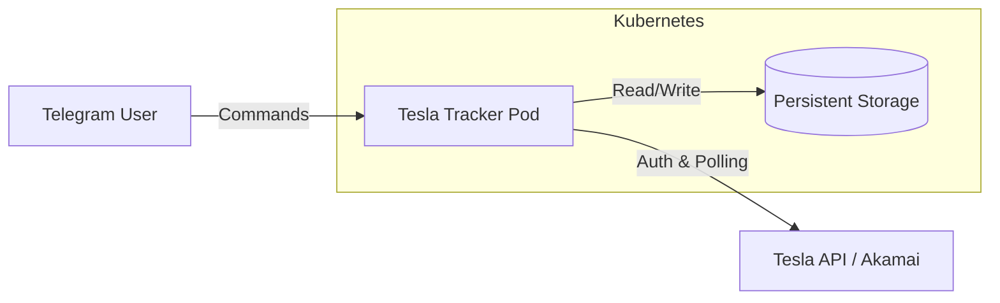

# 🚗 Tesla Kubernetes Tracker

A cloud-native, asynchronous Telegram bot for tracking Tesla vehicle orders with granular detail. 

Unlike simple tracking scripts, this system is architected to run permanently on **Kubernetes**, supporting **multi-user** environments, **persistence**, and **deep inspection** of "hidden" Tesla API data (Akamai Gateway).


## ✨ Features

- **🔎 Deep Intel**: Decodes `option codes` (e.g., "Matrix Headlights", "LFP Battery", "HW4") and VIN factory data.
- **🖼️ Visuals**: Fetches the exact render (image) of your car configuration.
- **⚡ Async & Fast**: Built on `python-telegram-bot` v20+ with `asyncio` and `httpx`.
- **☁️ K8s Native**: 
    - **Self-Healing**: Liveness probes ensure 24/7 uptime.
    - **Persistent**: SQLite/JSON database stored on PVCs (survives pod restarts).
- **👥 Multi-User**: One bot instance serves multiple users, each with their own secure token.
- **🛡️ Secure**: 
    - OAuth 2.0 PKCE flow.
    - Non-root container execution.
    - Secrets management via K8s Secrets.

## 🏗️ Architecture

The system is deployed as a single Microservice in the `tesla-app` namespace.



## 🚀 Getting Started

### Prerequisites
*   Kubernetes Cluster (Minikube, K3s, or Cloud)
*   `kubectl` configured
*   Docker (for building the image)

### 1. Clone & Setup
```bash
git clone https://github.com/XaviFortes/tesla-tracker.git
cd tesla-tracker
```

### 2. Generate Secrets
You need a **Telegram Bot Token** (from [@BotFather](https://t.me/BotFather)) and an initial **Tesla Refresh Token**.

**Generate Tesla Token:**
Run the helper script locally to perform the OAuth flow:
```bash
uip install httpx
python get_initial_token.py
```
*Save the Refresh Token output!*

**Configure K8s Secrets:**
Copy the example and edit it:
```bash
cp k8s/secrets.example.yaml k8s/secrets.yaml
# Edit k8s/secrets.yaml with your BASE64 encoded Telegram Token
# (Tesla Token is now handled dynamically via /login command, not secrets!)
```

### 3. Build & Deploy
If you are running on a remote cluster (VPS), cross-compile for AMD64:

```bash
# Build
docker build --platform linux/amd64 -t youruser/tesla-tracker:latest .
docker push youruser/tesla-tracker:latest

# Update deployment.yaml image to match 'youruser/tesla-tracker:latest'
```

**Deploy to Kubernetes:**
```bash
kubectl apply -f k8s/namespace.yaml
kubectl apply -f k8s/
```

### 4. Usgae
Open your bot in Telegram and authenticate:

1.  **Start the bot:** `/start`
2.  **Login:** `/login <YOUR_REFRESH_TOKEN>`
    *   *The bot will validate it and begin polling.*
3.  **Check Status:** `/status`

#### Commands
| Command | Description |
| :--- | :--- |
| `/login <token>` | **Required.** Log in with your Tesla Refresh Token. |
| `/logout` | Remove your data from the bot. |
| `/status` | Check for updates immediately. |
| `/vin` | Decode VIN usage (Factory, Year). |
| `/options` | List all decoded hardware/software options. |
| `/image` | Generate a high-res image of your car. |
| `/interval <min>` | Set polling frequency (default 30m). |

## 🛠️ Troubleshooting

**ImagePullBackOff?**
Ensure your secret is base64 encoded correctly and your image is pushed to a registry accessible by the cluster.

**403 Forbidden?**
Tesla blocks old App Versions. Update `APP_VERSION` in `main.py` and rebuild.

**Bot not replying?**
Check logs: `kubectl logs -l app=tesla-tracker -n tesla-app -f`

## 📄 License
MIT